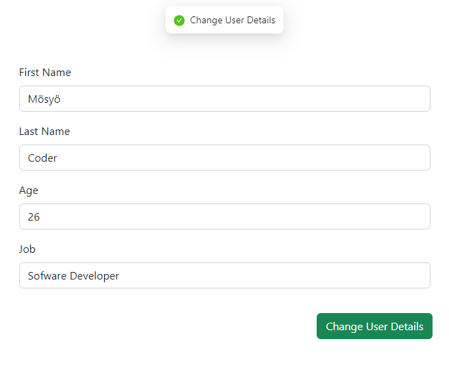

# Redux kullanmak için ilk olarak index.js dosyası içerisinde uygulamamızın tamamını Provider ögesi ile kaplamalıyız
# Daha sonra store dosyası içerisinde configureStore kullanarak storumuzu oluşturuyoruz
# Son olarak appSlice.js dosyası içerisinde createSlice kullanarak slice ismini, bileşenleri ve reducerları tanımlıyoruz

## Uygulamayı kurmak için yeni bir klasör oluşturup komut teminalinde açıyoruz

## git clone https://github.com/mosyocoder/instagram-redux-example.git komutu ile repoyu çekiyoruz

## npm install ile bağımlılıkları yükleyip npm start komutu ile uygulamayı çalıştırabiliriz

